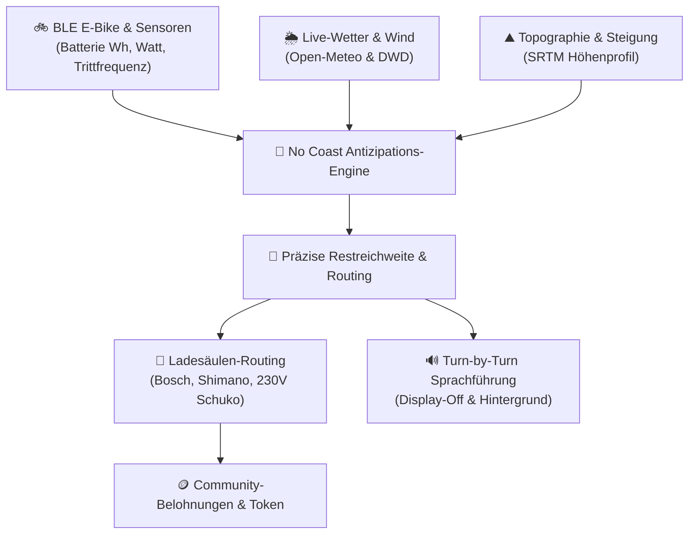

# 🚲 DER WEGWEISER — Intelligente KI E-Bike Navigation & Lade-Infrastruktur

<div align="center">

[](https://der-wegweiser.web.app)
[](https://play.google.com/apps/testing/app.derwegweiser.navi)
[](release/app-store/1.0.0-rc2/MAC_HANDOFF.md)
[](LICENSE)

[](https://react.dev)
[](https://www.typescriptlang.org)
[](https://vite.dev)
[](https://capacitorjs.com)
[](https://firebase.google.com)
[](https://ai.google.dev)
[](SECURITY.md)

**Der Wegweiser** ist eine zukunftsweisende E-Bike-Navigations- und Telemetrieplattform. Sie kombiniert vorausschauende KI-Routenplanung, Bluetooth-Low-Energy (BLE) Live-Fahrraddaten, verifizierte Ladeinfrastruktur-Karten und ein faires Community-Ökosystem in einer intuitiven Cyberpunk-Glasmorphism-Oberfläche.

[🌐 Jetzt Web-App starten](https://der-wegweiser.web.app) • [📖 Zur Wiki-Dokumentation](wiki/Home.md) • [🛡️ Sicherheitsrichtlinie](SECURITY.md) • [⚖️ Datenschutz & Löschung](https://der-wegweiser.web.app/privacy.html)

</div>

---

## 🌟 Highlights & Funktionen



* ⚡ **Präzise Reichweiten-Antizipation („No Coast Heuristik“):**
  * Berechnet die verbleibende E-Bike-Reichweite unter Berücksichtigung von realem Akkuzustand (Wh & %), Fahrergewicht, Steigungswiderstand und Gegenwind.
* 📡 **Live BLE-Fahrradtelemetrie:**
  * Direkte Bluetooth-GATT-Kopplung (Standard Cycling Power, Speed, Cadence & Battery Service) ohne proprietäre Cloud-Zwänge.
* 🔌 **Community-Ladeinfrastruktur & Scanner:**
  * Interaktive Karte verifizierter E-Bike-Ladepunkte (Bosch PowerPack/PowerTube, Shimano STEPS, Schuko 230V).
  * Foto-Meldefunktion für neue Ladesäulen mit integrierter UGC-Qualitätsprüfung (Apple Guideline 1.2 konform).
* 🔊 **Zuverlässige Turn-by-Turn Navigation:**
  * Minimierte Standortberechtigungen: Startet als transparenter Vordergrunddienst (`location`), führt Sprachansagen bei gesperrtem Bildschirm fort und beendet sich sofort nach Tourende.
* 🔒 **Datenschutz & Selbstbestimmung nach Art. 17 DSGVO:**
  * Vollständige Anonymität im Gastmodus.
  * Ein-Klick-Datenexport (Art. 15) und unwiderrufliche In-App- und Web-Sofortlöschung aller Cloud-Daten.
  * **0 Telemetrieverkauf**, keine externen Tracker, kein IDFA.

---

## 📱 Der Wegweiser nutzen

### 1. Sofort im Browser (PWA & Desktop)
Du kannst die Anwendung direkt ohne Installation auf jedem Smartphone, Tablet oder PC im Browser öffnen:
👉 **[https://der-wegweiser.web.app](https://der-wegweiser.web.app)**
*(Tipp: Im mobilen Browser auf „Zum Startbildschirm hinzufügen“ tippen für das native App-Erlebnis).*

### 2. Android (Google Play)
* **Application ID**: `app.derwegweiser.navi`
* **Aktiver Track**: Closed Testing
* **Opt-in für registrierte Tester**: [Google Play Testing Link](https://play.google.com/apps/testing/app.derwegweiser.navi)

### 3. iOS (Apple TestFlight)
* **Bundle ID**: `app.derwegweiser.navi`
* **Voraussetzung**: iOS 15.0+
* **Bereitstellung**: Über den Mac/Xcode-Build-Leitfaden in [`release/app-store/1.0.0-rc2/MAC_HANDOFF.md`](release/app-store/1.0.0-rc2/MAC_HANDOFF.md).

---

## 🛠️ Lokale Entwicklung & Schnellstart

### Voraussetzungen
* **Node.js**: Version 20+ (LTS empfohlen)
* **npm**: Version 10+
* **Git**: Installiert und konfiguriert

### 1. Repository klonen
```bash
git clone https://github.com/carlos1112-afk/der-wegweiser.git
cd der-wegweiser
```

### 2. Abhängigkeiten installieren
```bash
npm ci
```

### 3. Umgebungsvariablen konfigurieren
Kopiere die Vorlage `.env.example` nach `.env.local`:
```bash
cp .env.example .env.local
```
Trage deine Firebase- und optionalen Gemini-API-Schlüssel ein:
```env
VITE_FIREBASE_PROJECT_ID=der-wegweiser
VITE_FIREBASE_API_KEY=your_restricted_api_key_here
VITE_GEMINI_API_KEY=your_gemini_api_key_here
```

### 4. Lokalen Entwicklungsserver starten
```bash
npm run dev
```
Öffne [http://localhost:5173](http://localhost:5173) im Browser.

### 5. Qualitätssicherung & Sicherheitsscans
```bash
# Code-Format & Linter prüfen
npm run lint

# Automatischen Secret- & Schlüssel-Scan durchführen
node scripts/scan_secrets.js

# Produktions-Bundle bauen
npm run build
```

---

## 📂 Repository-Architektur

```
├── .github/                   # GitHub Actions CI/CD & Issue/PR Vorlagen
├── docs/                      # Architektur-, Store-Deklarationen & Datenflussmatrix
├── ios/                       # Natives Xcode 26+ iOS Projekt (Capacitor)
├── android/                   # Natives Gradle 8.14 Android Projekt (Target SDK 36)
├── public/                    # PWA Manifest, Icons, Privacy & Account-Deletion Webseiten
├── release/                   # Auditierte Release-Records & Play/AppStore Handoff-Dossiers
│   ├── google-play/           # Signiertes AAB, Data Safety & FGS-Video-Skript
│   └── app-store/             # iOS Compliance, Privacy Manifest & Mac-Handoff
├── scripts/                   # Automatisierte Sicherheitsprüfungen & Testsuiten
├── src/
│   ├── components/            # Modulare Glasmorphism UI (Map, HUDs, Modals, Co-Pilot)
│   ├── services/              # BLE-Treiber, Topographie, Offline-Kacheln, Routing
│   └── firebase.ts            # Client-SDK Initialisierung
└── wiki/                      # Umfassende Dokumentation & Betriebshandbuch
```

---

## 🛡️ Sicherheit & Compliance

* **0 Exponierte Secrets:** Quellcode enthält keine privilegierten Server-Tokens. Alle vertraulichen API-Aufrufe erfolgen über serverlose Proxies.
* **Gehärtete Firestore Rules:** Strikte Trennung nach Eigentümer (`isOwner`), Nutzersperren für gesperrte Konten (`isNotSuspended`) und Schutz vor fremden Schreibzugriffen.
* **Apple Guideline 1.2 & Google Play Location Policies:** Vollständig deklariert und implementiert.

Detaillierte Sicherheits- und Schwachstellenrichtlinien findest du in unserer [SECURITY.md](SECURITY.md).

---

## 🤝 Mitwirken (Contributing)

Beiträge zur E-Bike-Navigation, Verbesserung von Steigungsmodellen oder Unterstützung weiterer Sensor-Hersteller sind herzlich willkommen!
Bitte lies vor dem Erstellen eines Pull Requests unseren [CONTRIBUTING.md](CONTRIBUTING.md) Leitfaden und beachte den [Verhaltenskodex](CODE_OF_CONDUCT.md).

---

## ⚖️ Lizenz & Impressum

* **Lizenz:** Veröffentlicht unter der [MIT-Lizenz](LICENSE).
* **Diensteanbieter & Betreiber:** Pascal Gregor · Spreetal · Kontakt: `wegweiser-app@proton.me`
