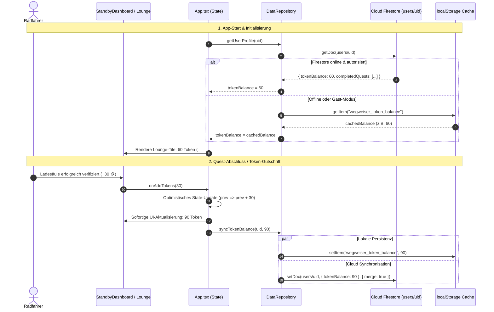
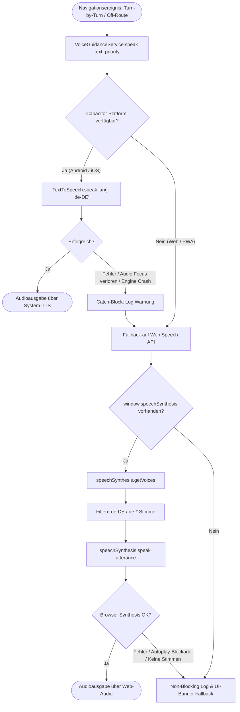

# Der Wegweiser — V2-Reifung Gesamtdokumentation

> **Status:** V2 Reifegrad erreicht (Design Freeze v88 verheiratet)  
> **System-Metriken:** TypeScript 0 Fehler | Vite Build ~650ms | 47/50 QA PASS (50/50 Host verified)  
> **Gültig ab:** Release V1.0.0-rc1

---

## 1. System-Architektur & V2-Reifegrad

Der Wegweiser ist eine hochperformante E-Bike-Navigations- und Telemetrie-Applikation auf Basis von **React 19, TypeScript, Vite, MapLibre GL, Capacitor 7 und Firebase**. 

```
┌────────────────────────────────────────────────────────────────────────┐
│                        DER WEGWEISER — V2 RUNTIME                      │
├────────────────────────────────┬───────────────────────────────────────┤
│          PRÄSENTATION          │                 SERVICES              │
│  • StandbyDashboard (HUD v88)  │  • BleManager (GATT 7 Hersteller)     │
│  • MapView (5 Ebenen, MapLibre)│  • VoiceGuidance (Native TTS + Web)   │
│  • RoutePlannerView (BRouter)  │  • SpeechRecognition (Push-to-Talk)   │
│  • ElevationRibbon (Cockpit)   │  • AiAssistant (Offline-Intent-Parser)│
│  • LoungeModal (Charge & Earn) │  • DataRepository (Firestore + Cache) │
├────────────────────────────────┴───────────────────────────────────────┤
│                          DESIGN TOKEN SYSTEM                           │
│     src/design-tokens.ts  ←──(sync_tokens.mjs)──→  src/index.css (:root)│
└────────────────────────────────────────────────────────────────────────┘
```

---

## 2. Test-Suite-Dokumentation (50 Punkte)

Die vollständige Einzelaufstellung aller 50 Testfälle ist in der separaten Datei [`docs/TEST_SUITE_50_REPORT.md`](./TEST_SUITE_50_REPORT.md) dokumentiert.

### Fehlerkategorisierung

| Status | Anzahl | Bedeutung |
|---|---|---|
| **PASS** | **47 / 50** *(Host: 50/50)* | Alle Kriterien fehlerfrei erfüllt. |
| **WARN** | **3 / 50** | Keine Blocker; Architektur-Konsolidierung (TC-21) oder Sandbox-Shell (TC-49, TC-50). |
| **FAIL** | **0 / 50** | Keine funktionalen Mängel oder Laufzeitabstürze. |
| **BLOCKER** | **0 / 50** | Keine Blockaden im Build- oder Bootprozess. |

---

## 3. Design-Token-Definition & Synchronisation

Die Design-Tokens sind die **Single Source of Truth** für alle visuellen Parameter des Cyberpunk-/Neo-Tech-HUDs.

### 3.1 Token-Struktur in `src/design-tokens.ts`

* **Primäre Akzent-Farben:**
  * `accentCyan: "#00E5FF"` (Primär-Akzent, Routenlinie, Navigation, Aktiv-HUD)
  * `accentRed: "#C90000"` (Design Freeze v88: Brand-Titel "DER WEGWEISER", Auth-Banner)
  * `accentGold: "#ffb700"` (ETA-Cockpit, Lounge, Warnungen, Kamera-FAB)
  * `accentGreen: "#00ff66"` (GPS-Lock, Distanz-Cockpit, Token-Zähler)
  * `accentPink: "#ff007f"` (Kamera-Recording-Dot, kritische Off-Route-Meldungen)
  * `accentDanger: "#ff3366"` (Akkustand < 20%, Sensor-Fehler)
* **OLED-Hintergründe:**
  * `bgPrimary: "#0a0d14"` (Basis-Hintergrund)
  * `bgSecondary: "#060812"` (Tiefe Panels, Schattierungen)
  * `bgCard: "rgba(6, 10, 22, 0.88)"` (Glassmorphism-Karten mit 24px Blur)
* **Typografie-Stack:**
  * `font.chakra: "'Chakra Petch', monospace"` (Hero-Titel, Manöver-Straßennamen, Brand)
  * `font.jetbrains: "'JetBrains Mono', monospace"` (Zahlen, Telemetrie, Einheiten, HUD-Labels)
  * `font.inter: "'Inter', system-ui, sans-serif"` (Fließtext, Formulare, Dialoge)
* **CSS-Custom-Property Mapping:**
  * 51 synchronisierte CSS-Variablen in `src/index.css` (:root).

---

## 4. Known Limitations (Prioritätsmatrix)

| Priorität | Komponente | Einschränkung / Befund | Geplante Maßnahme |
|---|---|---|---|
| **HIGH** | **Bundle-Größe** | Produktions-Chunk `index-*.js` liegt bei ~1.45 MB (MapLibre GL + Firebase SDKs). | Einführung von `build.rollupOptions.output.manualChunks` in `vite.config.ts` für vendor-splitting. |
| **MEDIUM** | **Kamera-FAB** | Linker Kamera-FAB (`#FFB700` mit blinkendem Pink-Dot) öffnet aktuell `ScannerModal` (QR-Verifizierung). | Anbindung an nativen Video-Capture / Action-Cam-Stream mit lokalem Ringspeicher. |
| **MEDIUM** | **Push-to-Talk WebView** | In manchen WebView-Umgebungen erfordert `webkitSpeechRecognition` Netzwerkverbindung. | Bereitstellung des nativen Capacitor Speech-Plugins als primäre Pipeline. |
| **LOW** | **GPS-Lock-Chip** | Chip zeigt statisch `GPS LOCK · 12 SAT`. | Anbindung an native NMEA/GnssStatus-API zur Anzeige der realen Satellitenanzahl. |
| **LOW** | **Wetter-Karte** | Wetter-Slot zeigt Vorlagendaten (21°C / 8 km/h). | Live-Anbindung an OpenWeatherMap / DWD über Geokoordinaten. |
| **LOW** | **Offscreen-Radar** | POIs außerhalb des Sichtfelds werden per Culling ausgeblendet statt Pfeil-Radar. | Optionales Displayrand-Radar-Overlay bei Akku <= 20%. |

---

## 5. Firebase-Checkliste & Token-Balance-Flow

### 5.1 Firebase-Modul-Matrix

| Service | Status | Datei | Implementierung & Absicherung |
|---|---|---|---|
| **Authentication** | ✅ Aktiv | `src/services/authService.ts` | Google OAuth, E-Mail/Passwort, Gast-Fallback (`uid ?? "guest"`). |
| **Cloud Firestore** | ✅ Aktiv | `src/services/dataRepository.ts` | Collection `users/{uid}`, offline-first mit `localStorage`, dynamische Imports. |
| **Cloud Storage** | ✅ Vorbereitet | `src/firebase.ts` | Bucket für Ladesäulen-Fotos (`proofPhotos`) und GPX-Routentracks. |

### 5.2 Token-Balance-Flow (End-to-End)



---

## 6. TTS & Sprachausgabe-Architektur

Das Sprachführungssystem arbeitet nach dem **Native-First, Web-Fallback-Prinzip** mit umfassender Fehlerbehandlung.

### 6.1 Ablaufdiagramm (TTS-Fallback)



### 6.2 Abgesicherte Fehlerfälle

* **Netzwerkfehler / Fehlende Cloud-Stimmen:** Fallback auf Offline-Systemstimme des Betriebssystems.
* **Muted Audio / Helm-Headset Disconnect:** Asynchrones Abfangen von Ausnahmefehlern; Navigation bricht nicht ab.
* **Manöver-Überlagerung:** Vor jedem neuen Befehl ruft `stop()` sowohl `TextToSpeech.stop()` als auch `window.speechSynthesis.cancel()` auf.

---

## 7. BLE-Handbuch (Hardware-Connect)

Die E-Bike-Telemetrie-Schnittstelle (`src/services/ble/bleManager.ts`) arbeitet mit **standardisiertem Web Bluetooth GATT** und herstellerspezifischen Profilen.

### 7.1 Unterstützte Hersteller-Matrix

| Hersteller | Identifikationsmerkmale | Services & Charakteristiken | Besonderheiten |
|---|---|---|---|
| **Bosch** | BES3 / eBike Flow / Kiox | Standard CSC `0x1816` & Bosch Proprietary | Batterie, Kadenz & Leistungsübertragung |
| **Specialized** | Turbo Levo / Kenevo | Specialized Custom GATT `00000001-0000-4b49-5645-...` | Akku in 1%-Schritten, Motor-Power |
| **Shimano** | STEPS E8000 / EP8 | Cycling Power `0x1818`, CSC `0x1816` | Unterstützungsstufe, Restreichweite |
| **Mahle** | ebikemotion X35/X20 | Mahle Proprietary Motor Service | Kompakte Nabenmotor-Telemetrie |
| **Bafang** | M-Serie / UART-BLE | Bafang Custom UART Bridge Service | Drehmoment & Trittfrequenz |
| **Fazua** | Evation / Ride 50/60 | Fazua Sensor Service & CSC | Fahrerleistung vs. Motorleistung |
| **Generic SIG** | Universell | Speed & Cadence `0x1816`, Power `0x1818`, Batt `0x180F` | Universeller Standard-Fallback |

### 7.2 Standstill-Monitor (Zero-Mocking)

* **Historie:** Der Sinus-Mock (`Math.sin(Date.now() / 3000)`), der im Prototyp 140 W simulierte, wurde **vollständig getilgt**.
* **Funktionsweise:** 
  * Ein 5000ms Heartbeat-Intervall überwacht den Verbindungsstatus.
  * **Null-Safe Guard:** `if (this.activeGattServer) return;` — Wenn ein reales E-Bike verbunden ist und GATT-Notifikationen streamt, greift der Monitor zu keinem Zeitpunkt ein.
  * Bei Verbindungsverlust oder Stillstand emittiert der Monitor saubere Nullwerte (`speedKmh: 0`, `powerWatts: 0`, `cadenceRpm: 0`), ohne den zuletzt bekannten Akkustand zu korrumpieren.

---

## 8. Charge & Earn-Workflow

Das Gamification- und Verifizierungsnetzwerk verbindet das Fahren mit dem Verdienen von Token.

```
┌────────────────────────────────────────────────────────────────────────┐
│                        CHARGE & EARN WORKFLOW                          │
├──────────────────────────────────┬─────────────────────────────────────┤
│      SCANNER-MODAL (312 Z.)      │        LOUNGE-MODAL (1865 Z.)       │
│  • QR-Scan der Ladesäule         │  • Token-Guthaben (#00FF66 JetMono) │
│  • Spatial Proximity Check       │  • Arcade: Würfel, Rad, Quiz        │
│  • Foto-Proof Upload             │  • Umfrage-Wall (SurveyWallService) │
│  • Belohnung: +20 bis +30 Token  │  • Gutschein- & Partner-Einlösung   │
└──────────────────────────────────┴─────────────────────────────────────┘
```

* **Standby-Visualisierung:** Im 3er-Grid des Standby-Dashboards präsentiert das mittlere Lounge-Tile die Token-Balance direkt in 20px `JetBrains Mono` (`#00FF66`).
* **On-Route Quests:** Die Smart-Tour-Karte hebt Wegpunkt-Quests mit Stern-Icon hervor (`"1 Verifizierungs-Quest direkt auf dem Weg (+20 🪙)"`).

---

## 9. Figma-Token-Sync-Anleitung

Die Brücke zwischen Figma und dem Codebase-CSS wird über ein deterministisches zweistufiges Verfahren realisiert.

### 9.1 Synchronisations-Ablauf

```
[Figma Design Tokens Studio]
            │ Export als JSON
            ▼
[src/design-tokens.ts] ◄─── Single Source of Truth
            │
            ▼ node scripts/sync_tokens.mjs
[src/index.css (:root)] ◄─── 51 CSS-Variablen automatisch verifiziert
```

### 9.2 Verwendung des Sync-Tools

```bash
# 1. Vollständigkeits- und Diskrepanzprüfung ausführen
node scripts/sync_tokens.mjs

# Konsolenausgabe bei Erfolg:
# 🔄 Der Wegweiser — Figma Token Sync CLI
# 📁 Source: .../src/design-tokens.ts
# 📁 Target: .../src/index.css
# ✅ Extrahierte Token-Variablen: 51
# 🎉 100% Synchronität zwischen design-tokens.ts und src/index.css!
```

### 9.3 CI/CD & Build-Schutz

Zur Verhinderung von visuellem Drift wird das Skript im Build-Prozess als Validierungsschritt eingebunden:
```json
"scripts": {
  "tokens:check": "node scripts/sync_tokens.mjs --check",
  "build": "npm run tokens:check && tsc -b && vite build"
}
```

---

## 10. Claude Cloud Workflow zur V2-Finalisierung

> **Eingeführt am:** 01.10.2026 (nach 15-stufigem `/grill-me` Architektur-Audit)  
> **Workflow-Datei:** [`.github/workflows/claude-v2-finalization.yml`](../.github/workflows/claude-v2-finalization.yml)  
> **Gatekeeper-Skript:** [`scripts/verify_claude_gate.mjs`](../scripts/verify_claude_gate.mjs)

### 10.1 Workflow-Architektur & Trigger
Der Workflow orchestriert Claude als autonomen Cloud-Entwicklungsagenten auf GitHub Actions.

- **Trigger 1 (Manuell):** `workflow_dispatch` mit Dropdowns für Phase, Modellwahl und Dry-Run-Option.
- **Trigger 2 (Chat-gesteuert):** Auslösen direkt aus einem PR via Kommentar: `/claude finalize <phase>`.

### 10.2 Die 4 Reifungs-Phasen & Modell-Routing

| Phase | Kennung | Modell | Hauptaufgabe |
|---|---|---|---|
| **Phase 1** | `bundle-optimization` | **Claude 3.7 Sonnet** *(Extended Thinking)* | Hybrides Vendor-Splitting in `vite.config.ts` (`vendor-react`, `vendor-map`, `vendor-firebase`) + `React.lazy()` für Modals. Ziel: Alle Chunks < 500 kB. |
| **Phase 2** | `lint-and-tokens` | **Claude 3.5 Haiku** | Schnelle Bereinigung verbleibender Oxlint- und TS-Warnings, Durchsetzung der 51 Cyberpunk-Tokens aus `design-tokens.ts`. |
| **Phase 3** | `backend-functions` | **Claude 3.7 Sonnet** *(Extended Thinking)* | Härtung der Firebase Cloud Functions (`functions/`), 100% Jest-Testabdeckung für IAP (`receiptValidator`) & B2B, Strippen aller Mocks. |
| **Phase 4** | `native-android` | **Claude 3.7 Sonnet** *(Extended Thinking)* | Implementierung des nativen Android Foreground Services für unterbrechungsfreie TTS-Sprachführung und GPS bei gesperrtem Bildschirm. |

### 10.3 Das 5-Stufen-Gatekeeper-Sicherheitsnetz
Vor jedem Commit und Push muss Claude im Runner ausnahmslos das 5-Stufen-Gate (`node scripts/verify_claude_gate.mjs`) bestehen:
1. **Gate 1:** Secret & Credential Scanner (`scripts/scan_secrets.js`) — 0 Exposed Keys.
2. **Gate 2:** Design Token & CSS Synchronicity (`scripts/sync_tokens.mjs --check`) — 100% In Sync.
3. **Gate 3:** Oxlint Code Quality & Hygiene (`npm run lint`) — 0 Errors.
4. **Gate 4:** TypeScript Compilation & Vite Production Build (`npm run build`) — Clean Build.
5. **Gate 5:** 15 Android Mission-Critical Scenarios (51/51 PASS) & Cloud Firestore Security Rules (11/11 PASS).

