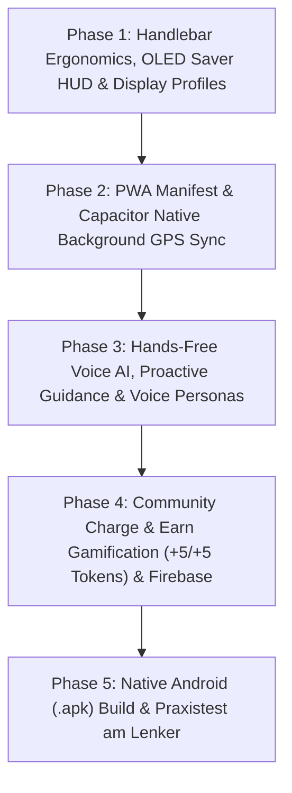

# 🚴 Der Wegweiser – Finaler Master-Entwicklungsplan (Abgestimmt via /grill-me)

> **Vision**: "Der Wegweiser" kombiniert modernste KI (Gemini), intelligentes E-Bike Akku-Managament, proaktive Hands-Free Sprachsteuerung, personalisierbare KI-Stimmen und Gamification zu einer wegweisenden Outdoor-Navigations-App.

---

## 1. 🎯 Final abgestimmte Kernentscheidungen (Grill-Me Ergebnisse)

### 🖥️ A. Display &amp; Ergonomie (OLED Battery Saver &amp; Auto-Wake Lock)

- **Standard-Modus**: **Beeline-Prinzip (OLED Black Mode)**. Bildschirm bleibt bei geraden Abschnitten tiefschwarz (maximaler Akkuschutz) und wacht 200 m vor Abbiegungen, per Screen-Tap oder Sprachbefehl auf.
- **Benutzerdefinierte Einstellungen**:
  1. `OLED Black Saver` (Auto-Wake 200m vor Kurve / Tap)
  2. `Standard Cockpit` (Durchgehend aktive High-Contrast Karte)
  3. `External Display Sync` (Auto-Off bei Kopplung mit Fahrrad-Display / Kiox / Garmin)

### 🎙️ B. Hands-Free KI-Assistent &amp; Proaktive Audio-Führung

- **Hybrid-Trigger**: Offline Wake-Word (*"Hey Wegweiser"*) + Bluetooth-Lenkerknopf &amp; Screen-Tap Fallback.
- **Proaktive KI-Audio-Vorschläge**: Die KI meldet sich bei Bedarf von selbst per Sprachausgabe (*"In 3 km ist dein Akku knapp, möchtest du zur Ladesäule abbiegen?"*) und wartet auf eine kurze Sprachbestätigung (*"Ja" / "Nein"*).

### 🗣️ C. Personalisierbare KI-Stimm-Personas (Free &amp; Premium)

- **Personas**: Vordefinierte Charakter-Stimmen (z. B. *Cyberpunk Anna, Sportlicher Tom, Gelassener Ben*) mit Reglern für Geschwindigkeit &amp; Tonhöhe.
- **Stufen**:
  - **Free Tier**: Lokale Web/System-Speech-Stimmen mit Charakter-Präsets.
  - **Premium Tier**: Hochrealistische neuronale Cloud-Stimmen (Google Cloud TTS / ElevenLabs), freischaltbar über Tokens oder Abo.
- **Einheitlichkeit**: Die gewählte Stimme spricht **sowohl die Navigationshinweise als auch die Assistenten-Dialoge**.

### 🪙 D. Gamification, Hindernismeldung &amp; Früh-Umleitungssystem

- **Hybrid Quick-Report (1-Tap &amp; Sprache)**: Sprachbefehl *"Baustelle melden"* oder 1-Tap Lenker-Button.
- **Token-Belohnungsstruktur**:
  - Baustelle/Hindernis melden: **+5 Tokens**
  - Früh-Umleitungspunkt setzen (verhindert Kehrtwendungen für andere): **+5 Zusatz-Tokens**
  - Kilometernetz-Bonus: **1 Token pro 10 km** zurückgelegter Strecke.
- **Monetarisierung &amp; Datenfutter**: CO₂-Wert bleibt unauffällige Compliance-Randnotiz; der volle Fokus liegt auf der Gamification für maximale Datenqualität.

### 📱 E. App-Packaging &amp; Deployment (PWA + Capacitor Synchron)

- **Synchrone Strategie**: Die App ist sofort als PWA im Smartphone-Browser testbar (Home-Bildschirm Installation) **und** wird parallel über Capacitor als native Android `.apk` kompiliert für vollen Hintergrund-GPS-Betrieb.

---

## 2. 🗺️ Entwicklungsfahrplan (Roadmap)

---

### 🎨 Phase 1: Handlebar-Ergonomie, OLED Saver HUD &amp; Display-Profile

- Implementierung des **Beeline-Prinzips (OLED Black Mode)** mit `Screen Wake Lock API`.
- **Einstellungsmenü für Display-Profile**: `OLED Saver`, `Standard Cockpit`, `External Display Sync`.
- Handschuh-freundliche Touch-Zonen (&gt;50px) &amp; High-Contrast Visuals.

### 📱 Phase 2: PWA Manifest &amp; Capacitor Native Background GPS Sync

- PWA `manifest.json` und Service Worker (`sw.js`) aktivieren.
- Capacitor Setup &amp; `@capacitor-community/background-geolocation` für unterbrechungsfreie Navigation bei gesperrtem Bildschirm.

### 🎙️ Phase 3: Hands-Free Voice AI, Proaktive Audio-Führung &amp; Stimm-Personas

- Offline Wake-Word (*"Hey Wegweiser"*) + Bluetooth-Remote Trigger.
- Proaktive KI-Audio-Vorschläge mit Sprachbestätigung (*"Ja" / "Nein"*).
- **Stimm-Personas (Free &amp; Premium)** für einheitliche Sprachausgabe (Navigation + Assistent).

### 🪙 Phase 4: Community Gamification (+5/+5 Tokens) &amp; Firebase Sync

- Hindernis-Melder mit Früh-Umleitungspunkt (+5 Tokens + 5 Zusatz-Tokens).
- 1 Token pro 10 km Belohnungs-Logik.
- Firestore Cloud-Synchronisation über das Projekt `der-wegweiser`.

### 📦 Phase 5: Native Android (.apk) Build &amp; Praxistest

- Generierung der Android `.apk`.
- Testen am Lenker bezüglich Sichtbarkeit, Spracherkennung bei Fahrtwind und Akkuverbrauch.

