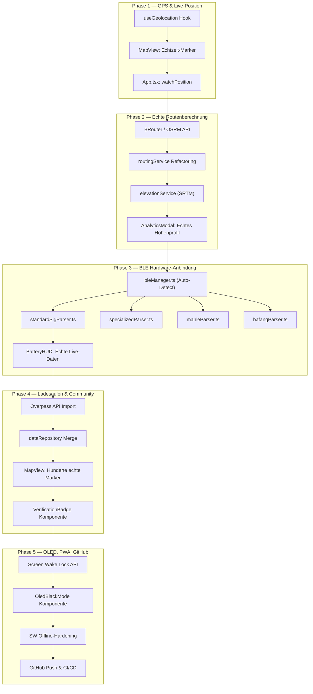

# 🗺️ Der Wegweiser — Detaillierter Implementierungsplan: Nächste Schritte

*Erstellt: 16. August 2026 · Basierend auf akribischer Codebase-Analyse aller 24 Quellcode-Dateien, 10 Services, 7 Komponenten, dem bestehenden Entwicklungsplan und aktueller Marktrecherche.*

---

## Ziel

Diesen Plan in 5 priorisierte Phasen aufteilen, die das Projekt **systematisch vom funktionierenden Prototyp zur produktionsreifen Beta-App** bringen. Jede Phase hat klare Deliverables, geschätzte Aufwände und Verifikationsschritte.

> [!IMPORTANT]
> **Aktueller Zustand (ehrliche Bestandsaufnahme):**
> - ✅ Frontend-Shell, Design-System, alle UI-Komponenten: **produktionsreif**
> - ✅ KI Multi-Modell-Pipeline (Gemini, Vertex, OpenRouter, HuggingFace, Phi-3): **produktionsreif**
> - ✅ Wetter-API (Open-Meteo): **Live-Daten, funktional**
> - ✅ Offline-Map-Tile-Download mit CacheStorage: **funktional**
> - ✅ GPX-Export (1.1 Standard): **funktional**
> - ✅ Sprachausgabe (Web Speech Synthesis): **funktional**
> - ✅ Firestore Dual-Sync (Cloud + LocalStorage): **funktional**
> - ✅ PWA Manifest & Service Worker: **vorhanden**
> - 🟡 BLE-Telemetrie (`bleService.ts`): **Simulation** — echtes Byte-Parsing fehlt
> - 🟡 Routing-Engine (`routingService.ts`): **mathematischer Kreis** — echte Radwege fehlen
> - 🟡 Ladesäulen-Daten: **3 Demo-Stationen** — kein Import von OSM/GoingElectric
> - 🟡 Bosch Flow Cloud Sync: **`setTimeout` Simulation** — keine echte Cloud-API
> - 🔴 GPS-Tracking (Live-Position): **Statische Koordinate** (Berlin Alexanderplatz fest)
> - 🔴 Native Android APK (Capacitor): **Nicht eingerichtet**
> - 🔴 OLED-Black-Mode / Screen Wake Lock: **Nicht implementiert**
> - 🔴 Wake-Word / Hands-Free Sprachsteuerung: **Nicht implementiert**
> - 🔴 GitHub Remote: **Kein Remote konfiguriert** (nur lokales Git)

---

## User Review Required

> [!WARNING]
> **Entscheidung 1: Routing-Engine Backend**
> Soll die echte Routenberechnung über einen eigenen OSRM-Server, über die Mapbox Directions API (kostenlose 100k Requests/Monat), oder über die kostenlose BRouter API laufen?
> - **OSRM**: Volle Kontrolle, aber eigener Server nötig (Cloud Run ~5€/Monat)
> - **BRouter**: Kostenlos, fahrrad-optimiert, Open Source, aber langsamer
> - **Mapbox**: Schnell, professionell, 100k Requests gratis, aber Vendor Lock-in

> [!WARNING]
> **Entscheidung 2: GitHub Repository**
> Soll das Repo als **Public** (Open Source MIT, Community-Beiträge möglich) oder **Private** (nur für dich sichtbar) angelegt werden? Unter welchem GitHub-Benutzernamen?

> [!IMPORTANT]
> **Entscheidung 3: Ladesäulen-Datenquelle**
> Primäre Datenquelle für E-Bike-spezifische Ladesäulen:
> - **OpenStreetMap Overpass API** (`amenity=charging_station` + `bicycle=yes`) — kostenlos, Community-gepflegt
> - **OpenChargeMap API** — große Datenbank, aber primär Auto-Ladesäulen
> - **Eigene Community-DB (Firestore)** — bereits implementiert, wächst durch Scanner-Feature

---

## Proposed Changes

### Phase 1: Echtes GPS-Tracking & Live-Standort (Sofort)
*Geschätzter Aufwand: 2–3 Stunden*

Das derzeit statische `userLocation` (`{lat: 52.52, lng: 13.405}`) muss durch echte Geolocation ersetzt werden.

#### [MODIFY] `src/App.tsx`
```diff
- const [userLocation] = useState({ lat: 52.52, lng: 13.405 });
+ const [userLocation, setUserLocation] = useState({ lat: 52.52, lng: 13.405 });
+
+ useEffect(() => {
+   if ('geolocation' in navigator) {
+     const watchId = navigator.geolocation.watchPosition(
+       (pos) => setUserLocation({ lat: pos.coords.latitude, lng: pos.coords.longitude }),
+       (err) => console.warn('Geolocation error:', err),
+       { enableHighAccuracy: true, maximumAge: 5000 }
+     );
+     return () => navigator.geolocation.clearWatch(watchId);
+   }
+ }, []);
```

#### [NEW] `src/hooks/useGeolocation.ts`
Custom Hook mit Accuracy-Tracking, Speed/Heading-Extraktion und Error-Handling für Permissions.

#### [MODIFY] `src/components/Map/MapView.tsx`
Karte auf den echten Standort zentrieren, pulsierender Marker für aktuelle Position, Richtungsanzeige.

---

### Phase 2: Echte Routing-Engine (Kernfunktionalität)
*Geschätzter Aufwand: 4–6 Stunden*

Ersetzen der mathematischen Kreisrouten durch echte fahrradtaugliche Routen mit Straßensnapping, Höhenprofilen und Oberflächeninformationen.

#### [MODIFY] `src/services/routingService.ts`
Komplettes Refactoring: Integration einer echten Routing-API (BRouter, OSRM oder Mapbox) mit:
- Echten befahrbaren Radwegen (keine mathematischen Sinus-Kurven mehr)
- Realen Höhenprofilen von SRTM/Mapbox Terrain
- Oberflächentyp-Erkennung (Asphalt vs. Schotter vs. Waldweg)
- Rundrouten-Algorithmus (Start = Ziel, mit thematischen Zielpunkten)

```typescript
// Neuer API-Call Ansatz (BRouter Beispiel)
const response = await fetch(
  `https://brouter.de/brouter?lonlats=${startLng},${startLat}|${viaLng},${viaLat}|${startLng},${startLat}&profile=trekking&alternativeidx=0&format=geojson`
);
const geojson = await response.json();
// → Echte Koordinaten, echte Höhenprofile, echte Distanzen
```

#### [NEW] `src/services/elevationService.ts`
Abruf von Höhendaten über die kostenlose Open-Meteo Elevation API oder Open-Elevation API.

#### [MODIFY] `src/components/Analytics/AnalyticsModal.tsx`
Echtes SVG-Höhenprofil basierend auf den realen Elevation-Daten der Route (statt simulierter Sinuskurve).

---

### Phase 3: Echte BLE-Telemetrie & E-Bike-Hardware (Alleinstellungsmerkmal)
*Geschätzter Aufwand: 6–8 Stunden*

Aktivierung der echten Web-Bluetooth-Verbindung basierend auf unserer neuen Protokoll-Datenbank (`data/ebike_protocols_database.json`).

#### [MODIFY] `src/services/bleService.ts`
Komplettes Refactoring in mehrere Schichten:

```typescript
// Neue Architektur
src/services/ble/
├── bleManager.ts          // Zentrale Verbindungsverwaltung & Auto-Reconnect
├── parsers/
│   ├── standardSigParser.ts    // BT SIG 0x1818, 0x1816, 0x180F
│   ├── specializedParser.ts    // Specialized Turbo TCU Custom GATT
│   ├── mahleParser.ts          // Mahle X35/X20 ANT+ LEV
│   └── bafangParser.ts         // Bafang CAN-over-BLE
└── bleSimulation.ts       // Fallback-Simulation (aktueller Code)
```

- Auto-Detection des verbundenen E-Bike-Typs anhand des BLE Device Name
- Dispatcher-Pattern: Richtiger Parser wird je nach Hersteller aktiviert
- Nahtloser Fallback auf Simulation, wenn kein BLE verfügbar

#### [NEW] `src/services/ble/parsers/standardSigParser.ts`
Implementierung des vollständigen Cycling Power (0x1818) und CSC (0x1816) Parsings aus `docs/EBIKE_COMMUNICATION_PROTOCOLS.md`.

#### [MODIFY] `src/types/navigation.ts`
Erweiterung von `LiveBikeTelemetry` um herstellerspezifische Felder:
```diff
  export interface LiveBikeTelemetry {
    isConnected: boolean;
    deviceName?: string;
+   manufacturer?: 'bosch' | 'shimano' | 'specialized' | 'mahle' | 'fazua' | 'bafang' | 'generic';
    batteryPercent: number;
+   batteryWh?: number;
+   batteryHealthPercent?: number;  // SOH
    speedKmH: number;
    cadenceRpm: number;
    riderPowerWatts: number;
+   motorPowerWatts?: number;
+   motorTemperatureC?: number;
    motorAssistMode: 'eco' | 'tour' | 'auto' | 'turbo' | 'off';
+   rangeRemainingKm?: number;
  }
```

---

### Phase 4: OSM Ladesäulen-Import & Community-Features
*Geschätzter Aufwand: 3–4 Stunden*

#### [NEW] `src/services/chargingStationImportService.ts`
Overpass-API Integration zum automatischen Import von E-Bike-Ladesäulen aus OpenStreetMap:
```typescript
const query = `
  [out:json][timeout:10];
  (
    node["amenity"="charging_station"]["bicycle"="yes"](${bounds.south},${bounds.west},${bounds.north},${bounds.east});
    node["amenity"="charging_station"]["socket:schuko"](${bounds.south},${bounds.west},${bounds.north},${bounds.east});
  );
  out body;
`;
const response = await fetch('https://overpass-api.de/api/interpreter', {
  method: 'POST',
  body: `data=${encodeURIComponent(query)}`,
});
```

#### [MODIFY] `src/services/dataRepository.ts`
Merge-Logik: OSM-Stationen + Firestore-Community-Stationen + lokale In-Memory Stationen = deduplizierte, vereinigte Ansicht.

#### [NEW] `src/components/ChargingScanner/VerificationBadge.tsx`
Community-Verifikations-Badges (🥇 Verifiziert von 10+ Nutzern, 🥈 5+, 🥉 1+).

---

### Phase 5: OLED-Mode, Screen Wake Lock, PWA-Hardening & GitHub Push
*Geschätzter Aufwand: 3–4 Stunden*

#### [NEW] `src/hooks/useScreenWakeLock.ts`
```typescript
export function useScreenWakeLock() {
  const [wakeLock, setWakeLock] = useState<WakeLockSentinel | null>(null);

  const requestWakeLock = async () => {
    if ('wakeLock' in navigator) {
      const lock = await navigator.wakeLock.request('screen');
      setWakeLock(lock);
    }
  };
  // ... release on unmount
}
```

#### [NEW] `src/components/DisplayModes/OledBlackMode.tsx`
OLED-Spar-Modus nach dem Beeline-Prinzip:
- Schwarzer Bildschirm bei geraden Streckenabschnitten
- Auto-Wake 200m vor der nächsten Abbiegung
- Minimales HUD: nur Richtungspfeil, Restdistanz, Akku%

#### [MODIFY] `public/sw.js`
Service Worker erweitern für echtes Offline-Caching (HTML-Shell + API-Responses) und Background Sync.

#### GitHub Push
```bash
git remote add origin https://github.com/<username>/der-wegweiser.git
git push -u origin main
```

---

## Phasen-Architektur (Gesamtbild)



---

## Verification Plan

### Automated Tests
```bash
# TypeScript Compilation Check (muss Exit-Code 0 liefern)
npm run build

# Linting
npm run lint

# CI/CD (nach GitHub Push automatisch)
# → .github/workflows/ci.yml prüft Build + Lint
```

### Manual Verification

| Phase | Prüfpunkt | Erwartetes Ergebnis |
|---|---|---|
| 1 | Browser öffnen, Standortfreigabe erlauben | Karte zentriert auf echten GPS-Standort |
| 2 | "Heute-Tour" generieren | Route folgt echten Straßen (keine Kreise), Höhenprofil zeigt reale Daten |
| 3 | Bluetooth-Gerät in Reichweite (oder Simulation) | BatteryHUD zeigt echte oder simulierte Werte mit korrektem Parser |
| 4 | Karte in Berlin verschieben | Dutzende OSM-Ladesäulen erscheinen als Marker |
| 5 | Navigations-Modus starten | Bildschirm bleibt aktiv (Wake Lock), OLED-Modus schaltet auf Schwarz |

---

## Open Questions

> [!IMPORTANT]
> **Frage 1:** Welchen **GitHub-Benutzernamen** soll ich für das Remote-Repository verwenden?

> [!IMPORTANT]
> **Frage 2:** Soll Phase 3 (BLE) **vor** Phase 2 (Routing) umgesetzt werden, weil die Hardware-Anbindung das stärkere Alleinstellungsmerkmal ist?

> [!IMPORTANT]
> **Frage 3:** Soll Capacitor (native Android APK) als **Phase 6** separat angegangen werden, oder direkt in Phase 5 integriert?

> [!IMPORTANT]
> **Frage 4:** Wie sollen die **Stimm-Personas** (Cyberpunk Anna, Sportlicher Tom, etc.) priorisiert werden — als eigenständige Phase oder als Teil der Voice-Guidance-Erweiterung?
