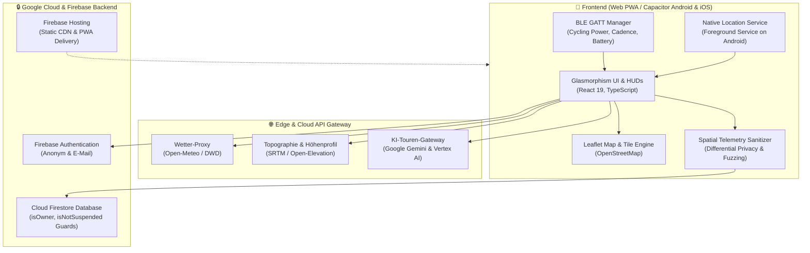

# 🏛️ Architektur & Datenfluss (Architecture & Data Flow)

Dieses Dokument beschreibt den technischen Aufbau, das Sicherheitsmodell und den Datenfluss von **Der Wegweiser**.

---

## 📐 Systemübersicht

---

## 🧩 Modulare Schichten

### 1. Präsentationsschicht (UI & HUD)
* **Framework:** React 19, Vite, modular aufgebautes CSS mit Cyberpunk-Glasmorphism-Design (`rgba(15, 23, 42, 0.85)` mit Cyan/Teal-Akzenten).
* **Karten-Engine:** Leaflet mit angepassten Vektor-Icons für Ladesäulen (Bosch, Shimano, Schuko) und interaktiven Polylines für Höhenprofile.
* **Sprachausgabe:** Standardisierte Web Speech API / native Text-to-Speech Engine für zeitkritische Abbiegehinweise.

### 2. Sensorik & Navigation
* **Bluetooth Low Energy (BLE):**
  * Direkter Zugriff über Web Bluetooth GATT bzw. Capacitor Core.
  * Unterstützte Standard-UUIDs: `0x1818` (Cycling Power), `0x1816` (Cycling Speed and Cadence), `0x180F` (Battery Service).
* **Vordergrunddienst (Android):**
  * Verwendet ausschließlich `FOREGROUND_SERVICE_LOCATION`.
  * Startet nur bei aktiver Nutzerinteraktion (*„Navigation starten“*), zeigt eine permanente Statusleisten-Benachrichtigung und stoppt sofort bei Tourende.
  * **Kein permanenter Hintergrunddienst (`ACCESS_BACKGROUND_LOCATION`)**.

### 3. KI & Heuristik (No-Coast-Engine)
* **AiGatewayService:**
  * Kapselt alle KI-Anfragen ab. Der Client besitzt **keine geheimen Provider-Keys**.
  * Fällt bei Verbindungsverlust nahtlos auf die lokale physikalische Reichweiten-Heuristik zurück (Formel basierend auf Akku-Restkapazität in Wh, Gesamtgewicht, Höhenmeter und Windgeschwindigkeit).

---

## 🔒 Firestore-Sicherheitsmodell & Datenmodell

Die Datenbank Cloud Firestore ist durch strikte Sicherheitsregeln ([`firestore.rules`](../firestore.rules)) abgesichert:

| Collection | Leserecht | Schreibrecht | Löschrecht | Verwendungszweck |
| :--- | :--- | :--- | :--- | :--- |
| `/users/{uid}` | Nur Eigentümer (`isOwner`) | Nur Eigentümer (`isOwner`) | Nur Eigentümer (`isOwner`) | Nutzerprofil & Einstellungen |
| `/user_tokens/{uid}` | Nur Eigentümer (`isOwner`) | Nur Eigentümer (`isOwner`) | Nur Eigentümer (`isOwner`) | Belohnungs-Token Saldo |
| `/charging_stations/{id}` | Öffentlich (`true`) | Authentifiziert & `isNotSuspended` | Ersteller (`createdByUserId`) | Verifizierte Ladesäulen |
| `/station_reviews/{id}` | Öffentlich (`true`) | Authentifiziert & `isNotSuspended` | Ersteller (`userId`) | Bewertungen & Erfahrungsberichte |
| `/content_reports/{id}` | **Strikt verboten** (`false`) | Authentifiziert & `isNotSuspended` | **Strikt verboten** (`false`) | Apple 1.2 UGC Moderationsmeldungen |
| `/suspended_users/{uid}` | **Strikt verboten** (`false`) | **Strikt verboten** (`false`) | **Strikt verboten** (`false`) | Serverseitige Nutzersperren |
| *Alle anderen Pfade* | **Strikt verboten** (`false`) | **Strikt verboten** (`false`) | **Strikt verboten** (`false`) | Default Deny Schutz |

---

## 🛡️ Datenschutz & Selbstbestimmung

1. **Gastmodus:** Die Navigation und Kartennutzung ist vollständig ohne Registrierung möglich.
2. **Datenexport (Art. 15 DSGVO):** Ein Klick im Daten-Cockpit exportiert alle gespeicherten Routen und Einstellungen als JSON.
3. **Recht auf Vergessenwerden (Art. 17 DSGVO):** Ein Klick auf *„Alle Daten unwiderruflich löschen“* entfernt das Nutzerkonto aus Firebase Auth und löscht alle zugehörigen Firestore-Dokumente restlos.
